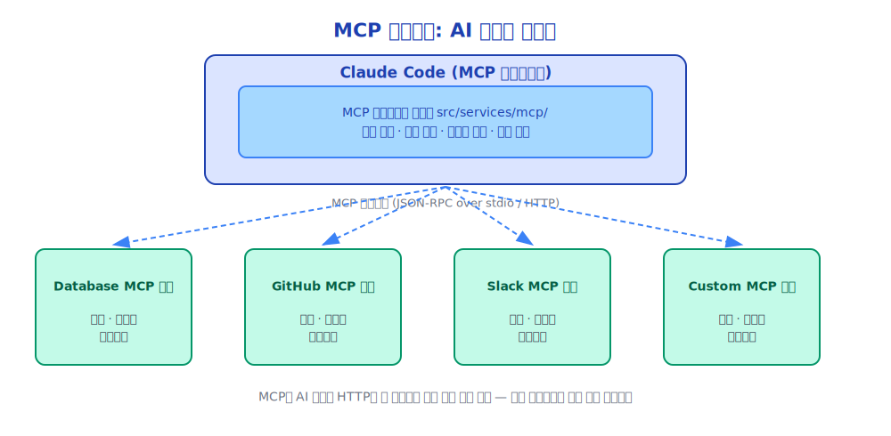
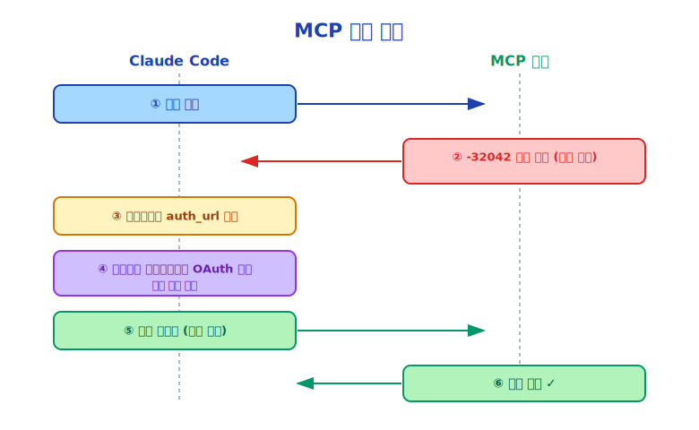

# 제19장: MCP 프로토콜 — 도구의 인터넷

> MCP는 AI 도구에 있어 HTTP가 웹 페이지에 해당하는 것입니다 — 도구들이 서로 연결될 수 있게 해주는 개방형 프로토콜입니다.

---

## 19.1 MCP란 무엇인가

MCP(Model Context Protocol)는 Anthropic이 2024년에 제안한 개방형 프로토콜로, AI 모델과 외부 도구/리소스 간의 표준 통신 방법을 정의합니다.

MCP 이전에는 각 AI 도구가 자체적인 통합 방식을 가지고 있었습니다:
- GitHub Copilot은 자체 API를 보유
- Cursor는 자체 플러그인(Plugin) 시스템을 보유
- Claude Code는 자체 도구 정의를 보유

이로 인해 파편화 문제가 발생했습니다: 한 AI 도구를 위해 개발된 통합은 다른 도구에서 직접 사용할 수 없었습니다.

MCP의 목표: **어떤 도구든 MCP를 지원하는 모든 AI에서 사용 가능하게 하는 것**.

---

## 19.2 MCP 아키텍처



MCP 서버는 세 가지 유형의 리소스를 제공할 수 있습니다:
- **도구(Tools)**: Claude가 호출할 수 있는 함수
- **리소스(Resources)**: Claude가 읽을 수 있는 데이터 (파일, 데이터베이스 레코드 등)
- **프롬프트(Prompts)**: 미리 정의된 프롬프트 템플릿

---

## 19.3 Claude Code의 MCP 클라이언트

`src/services/mcp/`는 완전한 MCP 클라이언트를 구현합니다:

```typescript
// MCP 서버 연결
type MCPServerConnection = {
  name: string              // 서버 이름
  transport: MCPTransport   // 전송 방식 (stdio 또는 HTTP)
  tools: MCPTool[]          // 서버가 제공하는 도구 목록
  resources: MCPResource[]  // 서버가 제공하는 리소스 목록
  prompts: MCPPrompt[]      // 서버가 제공하는 프롬프트 목록
}

// MCP 서버에 연결
async function connectMCPServer(config: MCPServerConfig): Promise<MCPServerConnection> {
  const transport = config.type === 'stdio'
    ? new StdioTransport(config.command, config.args)
    : new HTTPTransport(config.url)

  const client = new MCPClient(transport)
  await client.connect()

  return {
    name: config.name,
    transport,
    tools: await client.listTools(),
    resources: await client.listResources(),
    prompts: await client.listPrompts(),
  }
}
```

---

## 19.4 MCP 도구의 동적 등록

MCP 서버가 제공하는 도구는 Claude Code의 도구 시스템(Tool System)에 동적으로 등록됩니다:

```typescript
// MCP 도구를 Claude Code 도구로 래핑
function wrapMCPTool(mcpTool: MCPTool, server: MCPServerConnection): Tool {
  return {
    name: `mcp__${server.name}__${mcpTool.name}`,  // 충돌 방지를 위한 네임스페이스
    description: mcpTool.description,
    inputSchema: mcpTool.inputSchema,

    async execute(input, context) {
      // MCP 프로토콜을 통해 도구 호출(Tool Call)
      const result = await server.callTool(mcpTool.name, input)
      return { type: 'tool_result', content: result }
    }
  }
}
```

도구 이름 네임스페이스에 주목하십시오: `mcp__<서버명>__<도구명>`. 이는 서로 다른 MCP 서버의 도구 이름 충돌을 방지합니다.

---

## 19.5 MCP 리소스 접근

MCP 리소스는 `ListMcpResourcesTool`과 `ReadMcpResourceTool`을 통해 접근합니다:

```typescript
// 모든 MCP 리소스 목록 조회
await ListMcpResourcesTool.execute({
  server_name: 'github'  // 선택사항, 미지정 시 모든 서버의 리소스를 나열
}, context)
// 반환값: [{ uri: 'github://repos/myorg/myrepo', name: 'myrepo', ... }]

// 특정 리소스 읽기
await ReadMcpResourceTool.execute({
  uri: 'github://repos/myorg/myrepo/issues/123'
}, context)
// 반환값: 이슈 #123의 상세 내용
```

---

## 19.6 MCP 인증

MCP 서버는 인증을 요구할 수 있습니다. 인증 흐름:



`McpAuthTool`이 인증 흐름을 처리합니다:

```typescript
// MCP 도구 호출(Tool Call)이 -32042 오류(인증 필요)를 반환할 때
// McpAuthTool이 인증 흐름을 시작
await McpAuthTool.execute({
  server_name: 'github',
  auth_url: 'https://github.com/login/oauth/authorize?...'
}, context)
```

---

## 19.7 MCP 서버 설정

사용자는 설정 파일을 통해 MCP 서버를 추가합니다:

```json
// ~/.claude/settings.json
{
  "mcpServers": {
    "github": {
      "type": "stdio",
      "command": "npx",
      "args": ["-y", "@modelcontextprotocol/server-github"],
      "env": {
        "GITHUB_TOKEN": "ghp_..."
      }
    },
    "postgres": {
      "type": "stdio",
      "command": "npx",
      "args": ["-y", "@modelcontextprotocol/server-postgres"],
      "env": {
        "DATABASE_URL": "postgresql://..."
      }
    },
    "custom-api": {
      "type": "http",
      "url": "http://localhost:3000/mcp"
    }
  }
}
```

---

## 19.8 나만의 MCP 서버 개발

MCP 프로토콜은 개방형이므로, 누구든지 MCP 서버를 개발할 수 있습니다. 간단한 MCP 서버 예시:

```typescript
import { Server } from '@modelcontextprotocol/sdk/server/index.js'
import { StdioServerTransport } from '@modelcontextprotocol/sdk/server/stdio.js'

const server = new Server({
  name: 'my-tools',
  version: '1.0.0',
})

// 도구 등록
server.setRequestHandler('tools/list', async () => ({
  tools: [{
    name: 'get_weather',
    description: '지정한 도시의 날씨를 조회합니다',
    inputSchema: {
      type: 'object',
      properties: {
        city: { type: 'string', description: '도시 이름' }
      },
      required: ['city']
    }
  }]
}))

// 도구 호출(Tool Call) 처리
server.setRequestHandler('tools/call', async (request) => {
  if (request.params.name === 'get_weather') {
    const { city } = request.params.arguments
    const weather = await fetchWeather(city)
    return { content: [{ type: 'text', text: JSON.stringify(weather) }] }
  }
})

// 서버 시작
const transport = new StdioServerTransport()
await server.connect(transport)
```

---

## 19.9 MCP 생태계

MCP 프로토콜이 공개된 이후, 이미 많은 MCP 서버가 등장했습니다:

| 서버 | 제공 기능 |
|------|-----------|
| GitHub MCP | 이슈, PR, 코드 읽기/쓰기 |
| PostgreSQL MCP | 데이터베이스 쿼리 |
| Filesystem MCP | 파일시스템 접근 (샌드박스(Sandbox) 적용) |
| Brave Search MCP | 웹 검색 |
| Slack MCP | Slack 메시지 읽기/쓰기 |
| Google Drive MCP | Google Drive 접근 |
| Puppeteer MCP | 브라우저 제어 |

이 생태계는 아직도 빠르게 성장하고 있습니다.

---

## 19.10 MCP 설계 철학

MCP의 설계는 몇 가지 중요한 원칙을 구현하고 있습니다:

**개방형 표준**: MCP는 Anthropic의 독점 API가 아닌 개방형 프로토콜입니다. 모든 AI 도구가 MCP 클라이언트를 구현할 수 있으며, 모든 서비스가 MCP 서버를 구현할 수 있습니다.

**관심사의 분리**: AI 모델은 도구의 구현 세부 사항을 알 필요가 없으며, 도구의 인터페이스(이름, 설명, 스키마)만 알면 됩니다.

**보안 경계**: MCP 서버는 별도의 프로세스에서 실행되어 AI 모델과 격리됩니다. 서버 권한은 AI가 결정하는 것이 아니라 사용자가 설정합니다.

**조합 가능성**: 여러 MCP 서버를 동시에 연결할 수 있으며, Claude는 여러 서버의 도구를 조합하여 사용할 수 있습니다.

---

## 19.11 요약

MCP는 Claude Code의 기능 확장을 위한 핵심 메커니즘입니다:

- **개방형 프로토콜**: 모든 서비스가 MCP 서버가 될 수 있습니다
- **동적 등록**: MCP 도구가 Claude Code의 도구 시스템(Tool System)에 자동으로 등록됩니다
- **세 가지 리소스 유형**: 도구(호출 가능), 리소스(읽기 가능), 프롬프트(템플릿)
- **인증 지원**: 내장된 OAuth 인증 흐름
- **생태계**: 사용 가능한 기성 MCP 서버 다수 제공

MCP는 Claude Code의 기능 범위를 "내장 도구"에서 "인터넷 전체의 서비스"로 확장합니다.

---

*다음 장: [스킬(Skills) 시스템](./20-skills_ko.md)*
