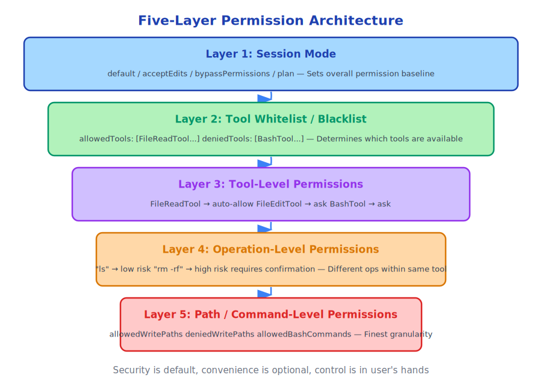

# Chapter 22: Layered Permission Model Design

> A good permission system makes security the default and convenience optional.

---

## 22.1 The Core Contradiction in Permission Design

AI Agent permission design faces a fundamental contradiction:

**The more powerful the capability, the greater the risk.**

Claude Code can execute shell commands, modify files, access networks — these capabilities make it very useful, but also mean an incorrect operation could cause serious consequences.

The solution to this contradiction is not to limit capabilities, but to **fine-grained control of capability usage**.

---

## 22.2 Five-Layer Permission Architecture



Claude Code's permission system has five layers, from coarse to fine:

---

## 22.3 Layer 1: Session Mode

```typescript
type PermissionMode =
  | 'default'              // Ask before dangerous operations
  | 'acceptEdits'          // Auto-accept file edits
  | 'bypassPermissions'    // Skip all checks (dangerous!)
  | 'plan'                 // Can only generate plans
```

Session mode is set at startup and affects the permission baseline for the entire session.

**default mode** is the safest, suitable for daily use.

**acceptEdits mode** is suitable for trusting Claude's file modifications while remaining cautious about shell commands. This is a common middle ground: developers usually trust Claude to modify code but not to execute arbitrary commands.

**bypassPermissions mode** completely skips permission checks, suitable for fully trusted automation scenarios like CI/CD. The source code has explicit warnings:

```typescript
// Only use in fully trusted environments
// Misuse may lead to data loss or security issues
if (allowDangerouslySkipPermissions) {
  logWarning('Running with --dangerously-skip-permissions. All tool calls will be auto-approved.')
}
```

**plan mode** is the most restricted, Claude can only generate plans, cannot execute any tools. Suitable for scenarios requiring manual review.

---

## 22.4 Layer 2: Tool Whitelist/Blacklist

Users can configure which tools are allowed and which are prohibited:

```json
// ~/.claude/settings.json
{
  "allowedTools": ["FileReadTool", "GrepTool", "GlobTool"],
  "deniedTools": ["BashTool", "FileWriteTool"]
}
```

Or configure in CLAUDE.md:

```markdown
<!-- CLAUDE.md -->
# Tool Restrictions
Only allow read-only tools, no file modification or command execution.
```

---

## 22.5 Layer 3: Tool-Level Permissions

Each tool has default permission requirements:

| Tool | Default Permission | Reason |
|------|------------|------|
| FileReadTool | Auto-allow | Read-only, no side effects |
| GrepTool | Auto-allow | Read-only, no side effects |
| GlobTool | Auto-allow | Read-only, no side effects |
| FileEditTool | Ask (default mode) / Auto (acceptEdits) | Modifies files |
| FileWriteTool | Ask | Creates/overwrites files |
| BashTool | Ask | Executes arbitrary commands |
| WebFetchTool | Ask | Network access |

---

## 22.6 Layer 4: Operation-Level Permissions

Different operations of the same tool may have different risk levels:

```typescript
// BashTool operation-level permission analysis
function analyzeBashCommand(command: string): RiskLevel {
  if (isDangerousCommand(command)) {
    return 'high'    // Requires explicit confirmation
  }
  if (isNetworkCommand(command)) {
    return 'medium'  // Requires confirmation
  }
  if (isReadOnlyCommand(command)) {
    return 'low'     // Can auto-allow
  }
  return 'medium'    // Default requires confirmation
}

// Read-only commands (low risk)
const READ_ONLY_COMMANDS = ['ls', 'cat', 'grep', 'find', 'git log', 'git status', ...]

// Dangerous commands (high risk)
const DANGEROUS_PATTERNS = [/rm\s+-rf/, /mkfs/, /dd\s+.*of=\/dev\//, ...]
```

---

## 22.7 Layer 5: Path/Command-Level Permissions

Most fine-grained control:

```json
// Allow writes to specific paths
{
  "allowedWritePaths": ["./src/", "./tests/"],
  "deniedWritePaths": ["./config/", "./.env"]
}

// Allow specific commands
{
  "allowedBashCommands": ["npm test", "npm run build", "git status"],
  "deniedBashCommands": ["rm -rf", "sudo"]
}
```

---

## 22.8 Permission Decision Recording and Auditing

All permission decisions are recorded:

```typescript
// Tool decision tracking
toolDecisions?: Map<string, {
  source: string           // Decision source (user interaction, config file, whitelist, etc.)
  decision: 'accept' | 'reject'
  timestamp: number
}>
```

This provides complete audit capability: can view which operations were allowed or denied, and why.

---

## 22.9 Permission Inheritance and Override

Sub-agents inherit parent agent permissions but can be further restricted:

```typescript
// When parent agent starts sub-agent, can restrict sub-agent permissions
await AgentTool.execute({
  prompt: '...',
  // Sub-agent can only read files, cannot write or execute commands
  allowedTools: ['FileReadTool', 'GrepTool', 'GlobTool'],
}, context)
```

Permissions can only be restricted, not expanded: sub-agents cannot have more permissions than parent agents.

---

## 22.10 Permission System User Experience

A good permission system shouldn't annoy users. Claude Code's design principles:

**Minimize interruptions**: Only ask when truly necessary, don't over-ask.

**Remember decisions**: After user allows once, same operation doesn't ask again (within same session).

**Clear explanations**: When asking, clearly explain what will be done, why permission is needed, and possible impacts.

**Fast response**: Permission checks shouldn't add noticeable latency.

---

## 22.11 Summary

Claude Code's permission model is a five-layer fine-grained control system:

1. **Session mode**: Overall permission baseline
2. **Tool whitelist/blacklist**: Tool-level switches
3. **Tool-level permissions**: Default behavior for each tool
4. **Operation-level permissions**: Risk classification for different operations of same tool
5. **Path/command-level permissions**: Most fine-grained control

Design principle: **Security is default, convenience is optional, control is in user's hands**.

---

*Next chapter: [Security Design](./23-security_en.md)*
