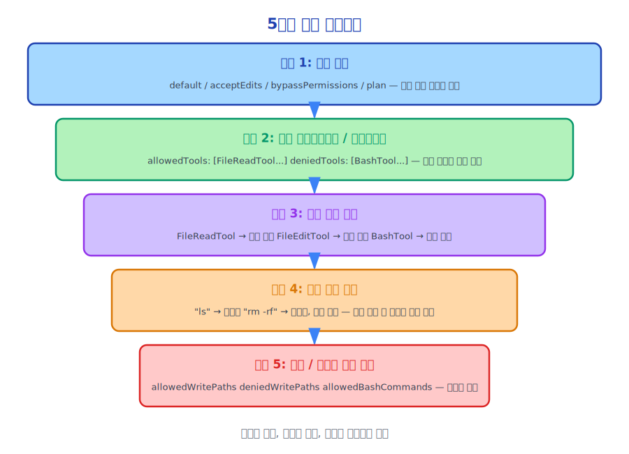

# 제22장: 계층형 권한 모델(Permission Model) 설계

> 좋은 권한 시스템은 보안을 기본값으로, 편의성을 선택지로 만듭니다.

---

## 22.1 권한 설계의 핵심 모순

AI 에이전트의 권한 설계는 근본적인 모순에 직면합니다.

**기능이 강력할수록 위험도도 높아집니다.**

Claude Code는 셸 명령 실행, 파일 수정, 네트워크 접근이 가능합니다. 이런 기능들이 매우 유용하지만, 동시에 잘못된 조작이 심각한 결과를 초래할 수 있음을 의미합니다.

이 모순의 해결책은 기능을 제한하는 것이 아니라, **기능 사용을 세밀하게 제어**하는 것입니다.

---

## 22.2 5계층 권한 아키텍처



Claude Code의 권한 시스템은 거칠게서 세밀하게 5개의 계층으로 구성됩니다.

---

## 22.3 계층 1: 세션 모드(Session Mode)

```typescript
type PermissionMode =
  | 'default'              // 위험한 작업 전에 확인 요청
  | 'acceptEdits'          // 파일 편집 자동 승인(Auto-approve)
  | 'bypassPermissions'    // 모든 검사 건너뜀 (위험!)
  | 'plan'                 // 계획만 생성 가능
```

세션 모드는 시작 시 설정되며 전체 세션의 권한 기준선에 영향을 줍니다.

**default 모드**는 가장 안전하며 일상적인 사용에 적합합니다.

**acceptEdits 모드**는 Claude의 파일 수정은 신뢰하지만 셸 명령에는 주의를 기울이는 경우에 적합합니다. 이는 일반적인 중간 지점입니다. 개발자들은 보통 Claude가 코드를 수정하는 것은 신뢰하지만, 임의의 명령을 실행하는 것은 그렇지 않습니다.

**bypassPermissions 모드**는 권한 검사를 완전히 건너뛰며 CI/CD처럼 완전히 신뢰할 수 있는 자동화 시나리오에 적합합니다. 소스 코드에는 명시적인 경고가 포함되어 있습니다.

```typescript
// 완전히 신뢰할 수 있는 환경에서만 사용하세요
// 잘못 사용하면 데이터 손실이나 보안 문제가 발생할 수 있습니다
if (allowDangerouslySkipPermissions) {
  logWarning('Running with --dangerously-skip-permissions. All tool calls will be auto-approved.')
}
```

**plan 모드**는 가장 제한적이며 Claude는 계획만 생성할 수 있고 어떤 도구도 실행할 수 없습니다. 수동 검토가 필요한 시나리오에 적합합니다.

---

## 22.4 계층 2: 도구 허용 목록/차단 목록

사용자는 어떤 도구를 허용하고 어떤 도구를 금지할지 설정할 수 있습니다.

```json
// ~/.claude/settings.json
{
  "allowedTools": ["FileReadTool", "GrepTool", "GlobTool"],
  "deniedTools": ["BashTool", "FileWriteTool"]
}
```

또는 CLAUDE.md에서 설정할 수 있습니다.

```markdown
<!-- CLAUDE.md -->
# 도구 제한
읽기 전용 도구만 허용하고, 파일 수정이나 명령 실행은 허용하지 않습니다.
```

---

## 22.5 계층 3: 도구 수준(Tool-Level) 권한

각 도구에는 기본 권한 요구 사항이 있습니다.

| 도구 | 기본 권한 | 이유 |
|------|------------|------|
| FileReadTool | 자동 허용 | 읽기 전용, 부작용 없음 |
| GrepTool | 자동 허용 | 읽기 전용, 부작용 없음 |
| GlobTool | 자동 허용 | 읽기 전용, 부작용 없음 |
| FileEditTool | 확인 요청(default 모드) / 자동(acceptEdits) | 파일 수정 |
| FileWriteTool | 확인 요청 | 파일 생성/덮어쓰기 |
| BashTool | 확인 요청 | 임의 명령 실행 |
| WebFetchTool | 확인 요청 | 네트워크 접근 |

---

## 22.6 계층 4: 작업 수준(Operation-Level) 권한

동일한 도구의 작업마다 서로 다른 위험 수준을 가질 수 있습니다.

```typescript
// BashTool 작업 수준 권한 분석
function analyzeBashCommand(command: string): RiskLevel {
  if (isDangerousCommand(command)) {
    return 'high'    // 명시적 확인 필요
  }
  if (isNetworkCommand(command)) {
    return 'medium'  // 확인 필요
  }
  if (isReadOnlyCommand(command)) {
    return 'low'     // 자동 허용 가능
  }
  return 'medium'    // 기본값은 확인 필요
}

// 읽기 전용 명령어 (낮은 위험도)
const READ_ONLY_COMMANDS = ['ls', 'cat', 'grep', 'find', 'git log', 'git status', ...]

// 위험한 명령어 (높은 위험도)
const DANGEROUS_PATTERNS = [/rm\s+-rf/, /mkfs/, /dd\s+.*of=\/dev\//, ...]
```

---

## 22.7 계층 5: 경로/명령어 수준 권한

가장 세밀한 제어 방법입니다.

```json
// 특정 경로에 대한 쓰기 허용
{
  "allowedWritePaths": ["./src/", "./tests/"],
  "deniedWritePaths": ["./config/", "./.env"]
}

// 특정 명령어 허용
{
  "allowedBashCommands": ["npm test", "npm run build", "git status"],
  "deniedBashCommands": ["rm -rf", "sudo"]
}
```

---

## 22.8 권한 결정 기록 및 감사

모든 권한 결정이 기록됩니다.

```typescript
// 도구 호출(Tool Call) 결정 추적
toolDecisions?: Map<string, {
  source: string           // 결정 출처 (사용자 상호작용, 설정 파일, 허용 목록 등)
  decision: 'accept' | 'reject'
  timestamp: number
}>
```

이를 통해 완전한 감사 기능을 제공합니다. 어떤 작업이 허용되거나 거부되었는지, 그 이유가 무엇인지 확인할 수 있습니다.

---

## 22.9 권한 상속 및 재정의

하위 에이전트는 상위 에이전트의 권한을 상속하지만 추가로 제한될 수 있습니다.

```typescript
// 상위 에이전트가 하위 에이전트를 시작할 때 하위 에이전트 권한을 제한할 수 있습니다
await AgentTool.execute({
  prompt: '...',
  // 하위 에이전트는 파일만 읽을 수 있고, 쓰기나 명령 실행 불가
  allowedTools: ['FileReadTool', 'GrepTool', 'GlobTool'],
}, context)
```

권한은 제한만 할 수 있고 확장은 불가합니다. 하위 에이전트는 상위 에이전트보다 더 많은 권한을 가질 수 없습니다.

---

## 22.10 권한 시스템 사용자 경험

좋은 권한 시스템은 사용자를 귀찮게 해서는 안 됩니다. Claude Code의 설계 원칙은 다음과 같습니다.

**방해 최소화**: 진정으로 필요할 때만 확인을 요청하고, 과도한 요청을 피합니다.

**결정 기억**: 사용자가 한 번 허용하면 동일한 작업에 대해 다시 묻지 않습니다(동일 세션 내).

**명확한 설명**: 확인을 요청할 때 무엇을 수행할지, 왜 권한이 필요한지, 가능한 영향이 무엇인지 명확하게 설명합니다.

**빠른 응답**: 권한 검사는 눈에 띄는 지연을 추가해서는 안 됩니다.

---

## 22.11 정리

Claude Code의 권한 모델(Permission Model)은 5계층 세밀 제어 시스템입니다.

1. **세션 모드**: 전체 권한 기준선
2. **도구 허용 목록/차단 목록**: 도구 수준 스위치
3. **도구 수준 권한**: 각 도구의 기본 동작
4. **작업 수준 권한**: 동일 도구의 다른 작업에 대한 위험 분류
5. **경로/명령어 수준 권한**: 가장 세밀한 제어

설계 원칙: **보안은 기본값, 편의성은 선택지, 제어권은 사용자에게**.

---

*다음 장: [보안 설계](./23-security_ko.md)*
